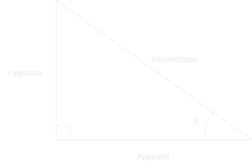

- [Back to Maths](./maths.md)
- [Back to Home](../../README.md)

# Trignometry
**Trignometry**: a sub-field of Geometry only consisting of Right-Angled Triangles.

- $\theta$ is an angle that exists inside the Right angled Triangle
- **Hypotenuse**: is the Longer side, opposite to the right angle
- **Adjacent**: The shorter side, next to the angle $\theta$
- **Opposite**: The side that the angle $\theta$ does not lie next to

# Pythagoream Theorem
This Theorem that a Right Angled Triangle with sides $a$, $b$, $c$ where $a$ and $b$ are the legs of the right angled triangle, while $c$ is the Hypotenuse, have the following relation:
$$
a^2 + b^2 = c^2
$$

## N-dimensional

The Pythagorean can be extended up to N dimensions as the following:

$$
|\vec{v}|^2 = v_x^2 + v_y^2 + v_z^2 + ...
$$

## SAS 

If given the length of 2 sides $a, b$ of a triangle and the angle between them $\theta$, the 3rd side can be described them as the following relation:

$$
a^2 + b^2 - 2ab \cos(\theta) = c^2
$$

# Main Trigometric Functions

$\sin$ and $\cos$ are the solutions to the following equation:

$$x^2 + y^2 = 1$$

(equation of a unit circle centered at the origin)

$$\sin(\theta)^2 + \cos(\theta)^2 = 1$$

$$\tan(\theta) = \frac{\sin(\theta)}{\cos(\theta)}$$

$$\csc(\theta) = \frac{1}{\sin(\theta)} $$

$$\sec(\theta) = \frac{1}{\cos(\theta)} $$

$$\cot(\theta) = \frac{1}{\tan(\theta)} $$

| Trig Function  | sin                                                | cos                                                | tan                                                     | csc                                                | sec                                               | cot                                                               |
| -------------- | -------------------------------------------------- | -------------------------------------------------- | --------------------------------------------------------| -------------------------------------------------- | ------------------------------------------------- | ----------------------------------------------------------------- |
| $\sin(\theta)$ | $\sin(\theta)$                                     | $\sqrt{1 - \cos(\theta)^2}$                        | $\frac{\tan(\theta)}{\sqrt{1 + \tan(\theta)^2} }$       | $\frac{1}{\csc(\theta)}$                           | $\sqrt{1 - \frac{1}{\sec(\theta)^2} }$            | $\frac{1}{\sqrt{1 + \cot(\theta)^2} }$                            |
| $\cos(\theta)$ | $\sqrt{1 - \sin(\theta)^2}$                        | $\cos(\theta)$                                     | $\sqrt{1 - \frac{\tan(\theta)^2}{1 + \tan(\theta)^2} }$ | $\sqrt{1 - \frac{1}{\csc(\theta)^2} }$             | $\frac{1}{\sec(\theta)}$                          | $\sqrt{1 - \frac{1}{1 + \cot(\theta)^2} }$                        |
| $\tan(\theta)$ | $\frac{\sin(\theta)}{\sqrt{1 - \sin(\theta)^2} }$  | $\frac{\sqrt{1 - \cos(\theta)^2} }{\cos(\theta)}$  | $\tan(\theta)$                                          | $\frac{1 }{\sqrt{\csc(\theta)^2 - 1} }$            | $\sqrt{\sec(\theta)^2 - 1}$                       | $\frac{1}{\cot(\theta)}$                                          |
| $\csc(\theta)$ | $\frac{1}{\sin(\theta)}$                           | $\frac{1}{\sqrt{1 - \cos(\theta)^2} }$             | $\frac{\sqrt{1 + \tan(\theta)^2} }{\tan(\theta)}$       | $\csc(\theta)$                                     | $\frac{\sec(\theta)}{\sqrt{\sec(\theta)^2 - 1} }$ | $\sqrt{\cot(\theta)^2 + 1}$                                       |
| $\sec(\theta)$ | $\frac{1}{\sqrt{1 -\sin(\theta)^2} }$              | $\frac{1}{\cos(\theta)}$                           | $\sqrt{1 + \tan(\theta)^2}$                             | $\frac{\csc(\theta)}{\sqrt{\csc(\theta)^2 - 1 } }$ | $\sec(\theta)$                                    | $\sqrt{1 + \frac{1}{\tan(\theta)^2} }$                            |
| $\cot(\theta)$ | $\frac{\sqrt{1 - \sin(\theta)^2} }{\sin(\theta)}$  | $\frac{\cos(\theta)}{\sqrt{1 - \cos(\theta)^2} }$  | $\frac{1}{\tan(\theta)}$                                | $\sqrt{\csc(\theta)^2 - 1}$                        | $\frac{1}{\sqrt{\sec(\theta)^2 - 1} }$            | $\cot(\theta)$                                                    |

# Identities:

> Context:
> $ \theta = \theta_{rad}$ same for $\alpha$ and $\beta$
> 
> $$ \theta_{rad} = \frac{2 \pi}{360}(\theta_{deg})$$
> 
> (for compactness use purpose)
> $$ S := \{\sin(\theta), \cos(\theta), \tan(\theta), \csc(\theta), \sec(\theta), \cot(\theta)\} $$

$$\forall (f \in S) [f(\theta \pm 2\pi) = f(\theta \mod 2\pi) = f(\theta)]$$

$$\sin(- \theta) = - \sin(\theta)$$

$$\cos(- \theta) = \cos(\theta)$$

**Pythagorean Identities**:

$$ \sin(\theta)^2 + \cos(\theta)^2 = 1$$

$$ 1 + \tan(\theta)^2 = \sec(\theta)^2$$

$$ 1 + \cot(\theta)^2 = \csc(\theta)^2$$

**Angle Sum/Difference Identities**:

$$\sin(\alpha + \beta) = \sin(\alpha) \cdot \cos(\beta) + \cos(\alpha) \cdot \sin(\beta)$$

$$\sin(\alpha - \beta) = \sin(\alpha) \cdot \cos(\beta) - \cos(\alpha) \cdot \sin(\beta)$$

$$\cos(\alpha + \beta) = \cos(\alpha) \cdot \cos(\beta) - \sin(\alpha) \cdot \sin(\beta)$$

$$\cos(\alpha - \beta) = \cos(\alpha) \cdot \cos(\beta) + \sin(\alpha) \cdot \sin(\beta)$$

**Function Product Identites**:

$$\sin(\alpha) \cdot \sin(\beta) = \frac{\cos(\alpha - \beta) - \cos(\alpha + \beta)}{2}$$

$$\sin(\alpha) \cdot \cos(\beta) = \frac{\sin(\alpha - \beta) + \sin(\alpha + \beta)}{2}$$

$$\cos(\alpha) \cdot \cos(\beta) = \frac{\cos(\alpha - \beta) + \cos(\alpha + \beta)}{2}$$

**Function Square Identities**:

$$ \sin(\theta)^2 = \frac{1 - \cos(2\theta)}{2} $$

$$ \cos(\theta)^2 = \frac{1 + \cos(2\theta)}{2} $$

**Euler's Identity**:

$$e^{i\theta} = \cos(\theta) + i \sin(\theta)$$

$$\sin(\theta) = i\frac{e^{-i\theta} - e^{i\theta}}{2}$$

$$\cos(\theta) = \frac{e^{i\theta} + e^{-i\theta}}{2}$$

$$\tan(\theta) = i\frac{e^{-i\theta} - e^{i\theta}}{e^{i\theta} + e^{-i\theta}}$$

$$\csc(\theta) = - i\frac{2}{e^{-i\theta} - e^{i\theta}}$$

$$\sec(\theta) = \frac{2}{e^{i\theta} + e^{-i\theta}}$$

$$\cot(\theta) = - i\frac{e^{i\theta} + e^{-i\theta}}{e^{-i\theta} - e^{i\theta}}$$

# Inverses:

each of the 6 trig functions have a defined Inverse function for symbolic purposes:

$$
\newcommand{\arccsc}[1]{\text{arccsc}#1}
\newcommand{\arcsec}[1]{\text{arcsec}#1}
\newcommand{\arccot}[1]{\text{arccot}#1}
$$

| Trig Function  | Inverse                     |
| -------------- | --------------------------- |
| $\sin(\theta)$ | $\sin^{-1}(x) = \arcsin(x)$ |
| $\cos(\theta)$ | $\cos^{-1}(x) = \arccos(x)$ |
| $\tan(\theta)$ | $\tan^{-1}(x) = \arctan(x)$ |
| $\csc(\theta)$ | $\csc^{-1}(x) = \arccsc(x)$ |
| $\sec(\theta)$ | $\sec^{-1}(x) = \arcsec(x)$ |
| $\cot(\theta)$ | $\cot^{-1}(x) = \arccot(x)$ |

$$
\cos(\theta) = \frac{e^{i\theta} + e^{-i\theta}}{2} \newline
y = \frac{e^{i\theta} + e^{-i\theta}}{2} \newline
2y = e^{i\theta} + e^{-i\theta} \newline
2y e^{i\theta} = e^{2i\theta} + e^{-i\theta + i\theta} \newline
2y e^{i\theta} = e^{2i\theta} + 1 \newline
e^{2i\theta} - 2y e^{i\theta} + 1 = 0\newline
(e^{i\theta})^2 - 2y (e^{i\theta}) + 1 = 0\newline

e^{i\theta} = \frac{- (- 2y ) \pm \sqrt{(- 2y)^2 - 4(1)(1)}}{2(1)} \newline
e^{i\theta} = \frac{2y \pm \sqrt{4y^2 - 4}}{2} \newline
e^{i\theta} = \frac{2y \pm 2\sqrt{y^2 - 1}}{2} \newline
e^{i\theta} = y \pm \sqrt{y^2 - 1} \newline
i\theta = \ln(y \pm \sqrt{y^2 - 1}) \newline
\theta = - i\ln(y \pm \sqrt{y^2 - 1}) \newline
$$
$$
\cos(\theta) = \frac{e^{i\theta} + e^{-i\theta}}{2} \newline
\arccos(\cos(\theta)) = - i\ln(\cos(\theta) \pm \sqrt{\cos(\theta)^2 - 1}) \newline
$$

$$
\arccos(x) = - i\ln(x + \sqrt{x^2 - 1})
$$
