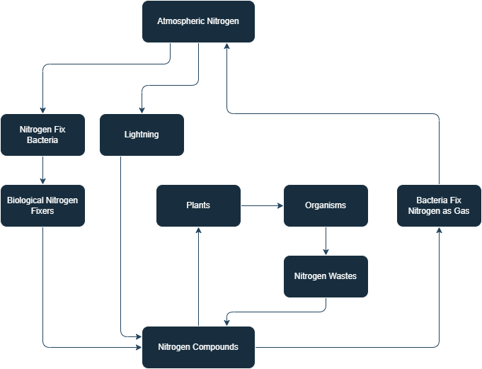

# Biology
## Microscopic

**Microorganisms**/**Microbes**: living organisms that are so small that they can't be seen without a microscope

**Microorganisms** (Major 4):
- **Bacteria**
- **Fungi**
- **Protozoa**
- **Algae**

**Non-Microorganism**:
- Virus

Some Microscopic organisms:
- Bacteria
- Algae
    - Chlamydomonas
    - Spirogyra
- Protozoa
    - Amoeba
    - Paramecium
- Fungi
    - Bread Mould
    - Pencillium
    - Aspergillus
- Virus
    - Bacteriophage

| Single-Celled | Multi-Cellular |
| ------------- | -------------- |
| Bacteria      | Fungi          |
| Algae         | Algae          |
| Protozoa      |                |

### Usefulness of Microorganisms

- *Wastes* and *Excreta* by living organisms is broken down into useable substances by Microorganisms
- *Bacteria* used in production of medicines
- They increase *Soil Fertility*
- **Lactobacillus**: promotes the formation of curd.
- **Fermentation**: the proccess of the conversion of sugar into alchohol, discovered in 1857 by Louise Pasteur
- **Yeast**: a fungus that promotes fermentation
    - Reproduces rapidly and produces Carbon Dioxide gas
    - Gown on natural sugar of grains, like barley, wheat, rice, fruit juice
    - used in production of: rice idlis, dosa batter, Alchohol, Wine, bread, pasteries, cakes etc.

**Biological Nitrogen Fixers**: **Rhizobium** Bacterium and certain Blue-Green Algae (**Cyanobacteria**) are some Microorganisms that can fix Atmospheric Nitrogen into Nitrogen Compounds

- **Rhizobium**: lives in the roots of Leguminous plants (pulses).

### Diseases

- **Pathogens**: disease causing microorganisms
- **Communicable DIseases**: microbial diseases that can spread from an infected person to a healthy person
- **Carriers**: animals/insects that carry a disease from one to another. Housefly is the most common carriers.
    - **Female Anopheles Mosquito**: carrier of *Plasmodium* (Malaria Parasite)
    - **female Aedes Mosquito**: carrier of the *Dengue Virus*

Human Diseases:

| Disease           | Transmission | Preventation      |
| ----------------- | ------------ | ----------------- |
**Bacteria**
| Tuberculosis (TB) | Air          | Isolation         |
| Typhoid           | Water        |                   |
| Cholera           | Water, Food  |                   |
**Fungi**
| Aspergillus       | Air          | -                 |
**Protozoa**:
| Dysentery         | -            | -                 |
| Malaria           | Mosquito     | Spray, nets, etc. |
**Algae**
**Virus**
| Cold              | -            | -                 |
| Influenza (flu)   | -            | -                 |
| Measles           | Air          | Isolation         |
| Chicken Pox       | Air, Contact |                   |
| Polio             | Air, Water   |                   |
| Hepatitis A       | Water        | Clean Water       |

Animal Diseases:

**Anthrax**: a dangerous human and cattle disease caused by Bacterium.
- Rober Koch (1876) discovered **Bacillus Anthracis** (bacterium) that causes **Anthrax disease**

Plant Diseases:

| Disease           | Transmission | Preventation      |
| ----------------- | ------------ | ----------------- |
**Bacteria**
| Citrus Canker     | Air          |                   |
**Fungi**
| Rust of Wheat     | Air, Seeds   |                   |
**Virus**
| Okra              | Insects      |                   |

### Antibiotics

**Antibiotics**: medicines that kill or stop the growth of disease-causing microorganisms
- Produces from Bacteria and Fungi
- example: Streptomycin, Tetracycline, and Erythromycin.

### Vaccine

When an intruder enters our body, the body produces Antibiotics to fight them, if the intruder comes again, our body will be able to defend more easily.
- **Vaccination**: training our body by introducing it a much weaker version of that intruder.

vaccines can prevent most diseases unless it evolves rapidly

diseases like Cholera, Tuberculosis, Smallpox, and Hepatitis can be prevented by Vaccination.

1798 Edwards Jenner discovered the vaccine for smallpox

Pulse Polio Programme: a Program for the protection of children against polio via vaccination

### Food

**Food Poisoning**: consumption of food spoilt by microorganisms

---

**Preservatives**: chemicals that controlt hte growth of microorganisms

- (Salts): Common Salt, Sodium Benzoate and Sodium Metabisulphite, used for: meat, fish, alma, raw mangoes, tamarind, jams, squashes, pickles.
- Oil
- Vinegar
- Suarger, used for: Jams, hellies, Squashes etc.

**Pasteurisation**: when an item is heated at high tempereature for some times and rapidly cooled, this kills all of the mircoorganisms in that item
- example: Milk heated at $70\degree$ for 15-30 seconds and chilled off then stored.
