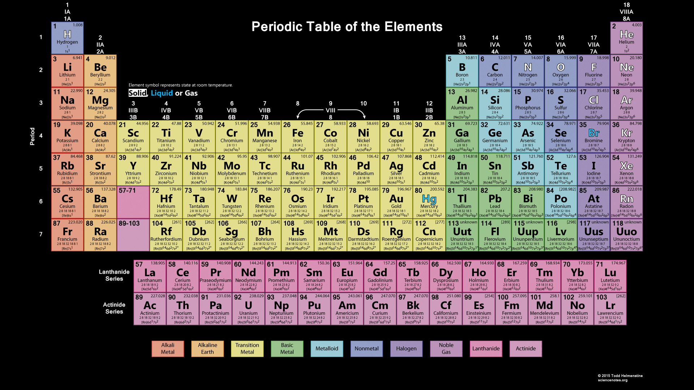

# Chemistry

$\newcommand{\e}[1]{\text{#1}}$

# Acids and Bases
## Characterestics
**Acid**:

Nature: **Acidic**
- Sour

**Base**:

Nature: **Basic**
- Bitter
- Soapy

## Indicators

**Indicators**: special type of susbstances used to test whether if a substance is acidic or basic

Natural Indicators: turmeric*, *litmus*, *China rose petals*

**Litmus**:
- Extracted from **litchens**
- *Purple* Color
- Turns **Red** when in-contact with **Acidic** substance.
- Turns **Blue** when in-contact with **Basic** substance.
- No Color Change when substance is **Neutral**

**China Rose Petal**
- *Pink* Color
- Turns **Magenta** when in-contact with **Acidic** substance.
- Turns **Green** when in-contact with **Basic** substance.

## Neutralization

**Neutralization**: The process of: when an *Acidic* solution is mixed with a *Basic* solution and both Neutralize/Cancel the effects of each other.

Produces:
- **Water**
- **Heat**
- **Salt**

Example:-

**Hydrochloric Acid** + **Sodium Hydroxide** = **Sodium Chloride** + **DiHydrogen Monoxide**

**HCI** + **NaOH** = **NaCI** + **H2O**

 

**Phenolphthalein**: an Indicator for Neutralization

-  **Turns Colorless**: if Neutralized

**Magnesium Hydroxide**: Neutralises effect of Excessive amount of acids
**Formic Acid**: can be neutralized by **baking soda** or **calamine solution**

### Soild
- Too Acidic Soild can be Neutralized by **Quick Lime** `(Calcium Oxide)` or **slaked lime** `(Calcium Hydroxide)`
- Too Basic Soild can be Neutralized by **Compost**

### Acids and Bases Found in:
| Acids                     | Found              |
| ------------------------- | ------------------ |
| Acetic Acid               | Vinegar            |
| Formic Acid               | Ant's string       |
| Citric Acid               | Orange, lemons etc |
| Lactic Acid               | Curd               |
| Oxalic Acid               | Spinach            |
| Ascorbic Acid (Vitamin C) | Sour               |
| Tararic Acid              | Grapes, Mangoes    |
| Nitric Acid               | Bat Caves          |

| Base                | Found            |
| ------------------- | ---------------- |
| Calcium Hydroxide   | Lime water       |
| Ammonium Hydroxide  | Window Cleaner   |
| Sodium Hydroxide    | Soap             |
| Potassium Hydroxide | Soap             |
| Magnesium Hydroxide | Milk of Magnesia |

# Periodic Table

### Elements

| Symbolic                       | Element    | Atomic Number ($z$) | Mass ($m$) | Valency   | Electronic Configuration (shell wise) |
| :----------------------------- | ---------- | :-----------------: | :--------: | :-------: | ------------------------------------- |
| ${}_{1}^{1}\e{H}^{\pm}$        | Hydrogen   | $1$                 | $1$        | $1$       | $1$                                   |
| ${}_{2}^{4}\e{He}^{0}$         | Helium     | $2$                 | $4$        | $0$       | $2$                                   |
| ${}_{3}^{7}\e{Li}^{+}$         | Lithium    | $3$                 | $7$        | $1$       | $2, 1$                                |
| ${}_{4}^{9}\e{Be}^{2+}$        | Beryllium  | $4$                 | $9$        | $2$       | $2, 2$                                |
| ${}_{5}^{11}\e{B}^{3+}$        | Boron      | $5$                 | $11$       | $3$       | $2, 3$                                |
| ${}_{6}^{12}\e{C}^{4\pm}$      | Carbon     | $6$                 | $12$       | $4$       | $2, 4$                                |
| ${}_{7}^{14}\e{N}^{3-}$        | Nitrogen   | $7$                 | $14$       | $3$       | $2, 5$                                |
| ${}_{8}^{16}\e{O}^{2-}$        | Oxygen     | $8$                 | $16$       | $2$       | $2, 6$                                |
| ${}_{9}^{19}\e{F}^{-}$         | Flourine   | $9$                 | $19$       | $1$       | $2, 7$                                |
| ${}_{10}^{20}\e{Ne}^{0}$       | Neon       | $10$                | $20$       | $0$       | $2, 8$                                |
| ${}_{11}^{23}\e{Na}^{+}$       | Sodium     | $11$                | $23$       | $1$       | $2, 8, 1$                             |
| ${}_{12}^{24}\e{Mg}^{2+}$      | Magnesium  | $12$                | $24$       | $2$       | $2, 8, 2$                             |
| ${}_{13}^{27}\e{Al}^{3+}$      | Aluminium  | $13$                | $27$       | $3$       | $2, 8, 3$                             |
| ${}_{14}^{28}\e{Si}^{4\pm}$    | Silicon    | $14$                | $28$       | $4$       | $2, 8, 4$                             |
| ${}_{15}^{31}\e{P}^{3-}$       | Phosphorus | $15$                | $31$       | $3$       | $2, 8, 5$                             |
| ${}_{16}^{32}\e{S}^{2-}$       | Sulphur    | $16$                | $32$       | $2$       | $2, 8, 6$                             |
| ${}_{17}^{35.5}\e{Cl}^{-}$     | Chlorine   | $17$                | $35.5$     | $1$       | $2, 8, 7$                             |
| ${}_{18}^{40}\e{Ar}^{0}$       | Argon      | $18$                | $40$       | $0$       | $2, 8, 8$                             |
| ${}_{19}^{39}\e{K}^{+}$        | Potassium  | $19$                | $39$       | $1$       | $2, 8, 8, 1$                          |
| ${}_{20}^{40}\e{Ca}^{2+}$      | Calcium    | $20$                | $40$       | $2$       | $2, 8, 8, 2$                          |
| ${}_{21}^{45}\e{Sc}^{3+}$      | Scandium   | $21$                | $45$       | $3$       | $2, 8, 9, 2$                          |
| ${}_{22}^{48}\e{Ti}^{4\pm}$    | Titanium   | $22$                | $48$       | $4$       | $2, 8, 10, 2$                         |
| ${}_{23}^{51}\e{V}^{\square}$  | Vanadium   | $23$                | $51$       | $5, 4$    | $2, 8, 11, 2$                         |
| ${}_{24}^{52}\e{Cr}^{2}$       | Chromium   | $24$                | $52$       | $2$       | $2, 8, 13, 1$                         |
| ${}_{25}^{55}\e{Mn}^{\square}$ | Manganese  | $25$                | $55$       | $7, 4, 2$ | $2, 8, 13, 2$                         |
| ${}_{26}^{56}\e{Fe}^{2+, 3+}$  | Iron       | $26$                | $56$       | $2, 3$    | $2, 8, 14, 2$                         |
| ${}_{27}^{59}\e{Co}^{2+, 3+}$  | Cobalt     | $27$                | $59$       | $3, 2$    | $2, 8, 15, 2$                         |
| ${}_{28}^{59}\e{Ni}^{2}$       | Nickel     | $28$                | $59$       | $2$       | $2, 8, 16, 2$                         |
| ${}_{29}^{63.5}\e{Cu}^{1+,2+}$ | Copper     | $29$                | $63.5$     | $2, 1$    | $2, 8, 18, 1$                         |
| ${}_{30}^{65}\e{Zn}^{2+}$      | Zinc       | $30$                | $65$       | $2$       | $2, 8, 18, 2$                         |

### Element Naming Rules

Prefixes:

| Prefix   | Atoms | Example                                        |
| -------- | ----- | ---------------------------------------------- |
| Mono-    | 1     | Carbon monoxide (CO)                           |
| Di-      | 2     | sulfur dioxide (SO2)                |
| Tri-     | 3     | Nitrogen trioxide (N2O3) |
| Tetra-   | 4     | Carbon tetrachloride (CCl4)         |
| Penta-   | 5     | Phosphorus pentachloride (PCl5)     |
| Hexa-    | 6     | Sulfur hexafluoride (SF6)           |
| Hepta-   | 7     | Iodine heptafluoride (IF7)          |
| Octa-    | 8     | Octasulfur (S8)                     |
| Nona-    | 9     | Iodine nonafluoride (IF9)           |
| Deca-    | 10    | Decaborane (B10H14)      |
| Undeca   | 11    | (Rare)                                         |
| Dodeca   | 12    | (Rare)                                         |

`Note: "Mono-" is often omitted for the first element if there is only one atom, but retained for the second (e.g., CO₂ is carbon dioxide, not monocarbon dioxide).`

`Note2: These prefixes are typically used in covalent (molecular) compounds, where two non-metals bond and share electrons.`

`Note3: For ionic compounds (metal-nonmetal combinations), prefixes are not used because the ratio of ions is determined by their charges.`

## Compounds:

| substance   | Element                     | chemical          |
| ----------- | --------------------------- | ----------------- |
| Water       | DiHydrogen Monoxide         | H2O    |
| Carbon Gas  | Carbon Dioxide              | CO2    |
| Baking Soda | Sodium Bicarbonate          | NaHCO3 |
| Edible Salt | Sodium Chloride             | NaCl              |
| Dynamite    | Nitroglycerine              | C3H5N3O9.     |
| TNT         | Trinitrotoulene             | C7H5N3O6.     |
| Ruby        | Aluminum Oxide              | Al2O3 `(Cr impurity)`               |
| Sapphire    | Aluminum Oxide              | Al2O3                               |
| Emerald     | Beryllium Aluminum Silicate | Be3Al2(SiO3)6 |

### 1 Word Compound References

| Refer         | Element                     | chemical          |
| ------------- | --------------------------- | ----------------- |
| Sulphate      | Sulfer Oxide                | $SO         $ |
| Carbonate     | Carbon Trioxide             | $CO_3 $ |
| Bicarbonate   | Hydrogen Carbonate          | $HCO_3$ |
| Nitrite       | Nitrogen Dioxide            | $NO_2 $ |
| Nitrate       | Nitrogen Trioxide           | $NO_3 $ |
| Peroxynitrate | Nitrogen Tetraoxide         | $NO_4 $ |

### Terms

**General Terms**:
| Term            | Description                 | Examples |
| --------------- | --------------------------- | -------- |
| *`element`* Oxide | unknown amount of oxygen    | CO2, SiO3 |

**Silicate**: Elements Related with [Silicon](#Chemistry)

## Changes

**Physical**: 
- **Physical Properties**:  
- 

**Chemical**: 
