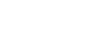
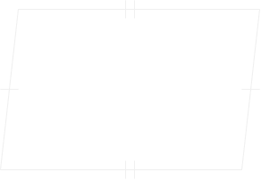

Sections:

Pure Mathematics

- [Arithmetic](#arithmetic)
- [Algebra](#algebra)
- [Linear Alegbra](#linear-alegbra)
- [Geometry](#geometry)
- [Trignometry](#trignometry)
- [Number Theory](#number-theory)
- [Calculus](#calculus)
- [Differential Equations](#differential-equations)
- [Combinatorics](#combinatorics)
- [Topology](#topology)
- [Logic](#logic)
	- [Set Theory](#set-theory)

Applied Mathematics

- [Financial Mathematics](#financial-mathematics)
- [Turing Machine](#turing-machine)
- [Information Theory](#information-theory)
- [Statistics](#statistics)
- [Game Theory](#game-theory)

# Other

## Symbols

## Constants

$f(0) = 0$

$f(1) = 1$

$f(n) = f(n-1) + f(n-2)$

| Symbol | Name               				 | Value                       | Obtain |
| ------ | --------------------------------- | --------------------------- | ------ |
| $\pi$  | **Pi**             				 | $3.14159265358979323846...$ |        |
| $\tau$ | **tau**            				 | $6.28318530717958647692...$ | $2\pi$ |
| $e$    | **Euler's Number** 				 | $2.71828182845904523536...$ | $$\displaystyle\sum_{n=0}^\infty\frac{1}{n!} = \frac{1 + \sqrt5}{2}$$ |
| $i$ 	 | **Imaginary Unit** 				 | $i$						   | $\sqrt{-1}$ |
| $\phi$ | **Golden Ratio**   				 | $1.61803398874989484820...$ | $$\lim_{n \to \infty}\frac{f(n)}{f(n-1)}$$ |
| $\psi$ | **Reciprocal Fibbonaci Constant** | $1.61803398874989484820...$ | $$ |

# Pure Mathematics

# Arithmetic

**Arithmetic**: a field of Mathematics containing the very Foundational Basics about it

## Successor, Predecessor

**Successor**: A Number `+1` of The Previous One

$
a+1
$

**Predecessor**: A Number `-1` for the Previous one

$
a-1
$

## Addition, Subtraction
**Addition** `(Add)`: Sum of any 2 Numbers

$
a+b
$

- Repeated Succession $b$ count of times on $a$

**Subtraction** `(Subtract)`: Subtraction of One Number from another

$
a-b
$

- Repeated Predecession $b$ count of times on $a$

## Multiplication, Division
**Multiplication** `(Multiply)`: Multiplication

$
a \times b
$
- Repeated Addition of `a` with itself `b` count of times

**Division** `(Divide)`: Divison of a Number in `b`  count of peices

$ a / b $

$ a \div b $
- Divison of $a$ into `b` count of Parts/Components Evenly

# Algebra
**Algebra**: a field of Mathematics consisting of English Aplhabet Represeting Number, with many use cases such as Representing Unknown/Dynamic Values.

## Identities

**Binomial**:
$$
(a + b)^2 = a^2 + 2ab + b^2
$$
$$
(a - b)^2 = a^2 - 2ab + b^2
$$
$$
(a + b)^3 = a^3 + 3a^2b + 3ab^2 + b^3
$$
$$
(a - b)^3 = a^3 - 3a^2b + 3ab^2 + b^3
$$
**Factorization**:
$$
ab + ac = a(b + c )
$$
$$
-a(b) + a(c) = -a(b -c) = a(-b + c)
$$

## Boolean Algebra
**Boolean Algebra**: A Branch of Algebra where the Variables can only have 2 possible states

- `1` standing for **TRUE**, **ON**.
- `0` standing for **FALSE**, **OFF**.

### Units
These Boolean Algebra Variables are used in Sets when representing Data
- **Bit**: A Single Variable, with only possible states of `0` and `1`.
- **Nibble**: a set of 4 Bits, with $2^4$ combinations with `0`'s and `1`'s.
- **Byte**: a set of 8 Bits, can represent a Single ASCII Character.
- **Octet**: a set of 4 Bytes or 32 bits, with a Total of $2^{32}$ combinations.

| Unit       | Comparison | Cominations       |
| ---------- | ---------- | ----------------- |
| **Bit**    | *Lowest*   | $2^{1}$, `0`, `1` |
| **Nibble** | `4 Bits`   | $2^{4}$           |
| **Byte**   | `8 Bits`   | $2^{8}$           |
| **Octet**  | `4 Bytes`  | $2^{32}$          |

**Exponential Units**:

**Bytes**,  `(base 10)`:
| Unit               | Comparison       | Bytes     |
| ------------------ | ---------------- | --------- |
| **KiloByte** `KB`  | `1000 Bytes`     | $10^{3}$  |
| **MegaByte** `MB`  | `1000 KiloBytes` | $10^{6}$  |
| **GigaByte** `GB`  | `1000 MegaBytes`  | $10^{9}$  |
| **TeraByte** `TB`  | `1000 GigaBytes`  | $10^{12}$ |
| **PetaByte** `PB`  | `1000 TeraBytes`  | $10^{15}$ |
| **ExaByte** `EB`   | `1000 PetaBytes`  | $10^{18}$ |
| **ZetaByte** `ZB`  | `1000 ExaBytes`   | $10^{21}$ |
| **YottaByte** `YB` | `1000 ZetaBytes`  | $10^{24}$ |

**Bytes**,  `(base 2)`:
| Unit               | Comparison       | Bytes    |
| ------------------ | ---------------- | -------- |
| **KibiByte** `KiB` | `1024 Bytes`     | $2^{10}$ |
| **MibiByte** `MiB` | `1024 KibiBytes` | $2^{20}$ |
| **GibiByte** `GiB` | `1024 MibiBytes` | $2^{30}$ |
| **TibiByte** `TiB` | `1024 GibiBytes` | $2^{40}$ |
| **PibiByte** `PiB` | `1024 TibiBytes` | $2^{50}$ |
| **ExbiByte** `EiB` | `1024 PibiBytes` | $2^{60}$ |
| **ZibiByte** `ZiB` | `1024 ExbiBytes` | $2^{70}$ |
| **YobiByte** `YiB` | `1024 ZibiBytes` | $2^{80}$ |

---
### Logic Gates:

Logic Gates are Gates that Determine the Output of Certain Inputs based on Logic which they Represent

Main Logic Gates:

- **Conjunction**, **AND** `(2 inputs)`: returns `1` if both inputs are `1`.
- **Disjunction**,  **OR** `(2 inputs)`: returns `1` if any of the inputs are `1`.
- **Negation**, **NOT** `(1 input)`: Inverts the given Input.
- **Exclusive OR**, **XOR** `(2 inputs)`: returns `1` if both inputs are not the same.

| $a$ | `NOT` $¬a$ |
| --- | ---------- |
| $0$ | $1$        |
| $1$ | $0$        |

| $a$ | $b$ | `AND` $a∧b$ | `OR` $a∨b$ | `XOR` $a \otimes b$ |
| --- | --- | ----------- | ---------- | ------------------- |
| $0$ | $0$ | $0$         | $0$        | $0$                 |
| $0$ | $1$ | $0$         | $1$        | $1$                 |
| $1$ | $0$ | $0$         | $1$        | $1$                 |
| $1$ | $1$ | $1$         | $1$        | $0$                 |

**Inverted Logic Gates**:

- **NOT Conjunction**, **NAND** `(2 inputs)`: returns `1` if both inputs are NOT `1`.
- **NOT Disjunction**,  **NOR** `(2 inputs)`: returns `1` if any of the inputs are NOT `1`.
- **NOT Exclusive OR**, **XNOR** `(2 inputs)`: returns `1` if both inputs ARE the same.

| $a$ | $b$ | `NAND` $¬(a∧b)$ | `NOR` $¬(a∨b)$ | `XNOR` $¬(a \otimes b)$ |
| --- | --- | --------------- | -------------- | ----------------------- |
| $0$ | $0$ | $1$             | $1$            | $1$                     |
| $0$ | $1$ | $1$             | $0$            | $0$                     |
| $1$ | $0$ | $1$             | $0$            | $0$                     |
| $1$ | $1$ | $0$             | $0$            | $1$                     |

**Totality of Logic Gates / Truth Tables**:

**Single Input**:
| $a$ | `BUFFER` | `NOT` |
| --- | -------- | ----- |
| $0$ | $0$      | $1$   |
| $1$ | $1$      | $0$   |

**Double Input**:
| $a$ | $b$ | `AND` | `OR` | `XOR` | `NAND` | `NOR` | `XNOR` |
| --- | --- | ----- | ---- | ----- | ------ | ----- | ------ |
| $0$ | $0$ | $0$   | $0$  | $0$   | $1$    | $1$   | $1$    |
| $0$ | $1$ | $0$   | $1$  | $1$   | $1$    | $0$   | $0$    |
| $1$ | $0$ | $0$   | $1$  | $1$   | $1$    | $0$   | $0$    |
| $1$ | $1$ | $1$   | $1$  | $0$   | $0$    | $0$   | $1$    |

### Latches

**SR Latch**: A Latch that can Hold upto 1 Bit of Data, with 2 Inputs and 2 Outputs

- `S`, `R` Inputs
- `Q`, `¬Q` Outputs
- `S` Sets The Output `Q` to 1, `¬Q` to 0 
- `R` Sets The Output `Q` to 0, `¬Q` to 1
- `¬Q` is Invert of The Main Output `Q`
- value of `Q` can be 0 or 1 depending on it's initial value
- `S` and `R` both 1 at the same is Invalid, as it's not supposed to happen and both Output `Q` and `¬Q` will be set to 0

Truth Table:

| `S` | `R` | `Q`    | `¬Q`   |
| --- | --- | ------ | ------ |
| $0$ | $0$ | $1, 0$ | $0, 1$ |
| $1$ | $0$ | $1$    | $0$    |
| $0$ | $1$ | $0$    | $1$    |
| $1$ | $1$ | $0$    | $0$    |

---
### Arithmetic

**Addition**: An Special Type of XOR Operation of Inputs, `a`, `b` and *Carry*

- $r = 1$, $c = 0$: IF any 1 is ON
- $r = 0$, $c = 1$: IF any 2 is ON
- $r = 1$, $c = 1$: IF all 3 is ON

| Carry | $a$ | $b$ | ($r$) result | Next Carry |
| ----- | --- | --- | ------------ | ---------- |
| $0$   | $0$ | $0$ | $0$          | $0$        |
| $0$   | $0$ | $1$ | $1$          | $0$        |
| $0$   | $1$ | $0$ | $1$          | $0$        |
| $0$   | $1$ | $1$ | $0$          | $1$        |
| $1$   | $0$ | $0$ | $1$          | $0$        |
| $1$   | $0$ | $1$ | $0$          | $1$        |
| $1$   | $1$ | $0$ | $0$          | $1$        |
| $1$   | $1$ | $1$ | $1$          | $1$        |

**Subtraction**: An Special Type of XOR Operation of Inputs, `a`, `-b` and *Carry*
- `Carry` acts as a Negative Value
- `0` Carry and `0` result if any 2 is `1`

| Carry | $a$ | $-b$ | ($r$) result | Next Carry |
| ----- | --- | ---- | ------------ | ---------- |
| $0$   | $0$ | $0$  | $0$          | $0$        |
| $0$   | $0$ | $1$  | $1$          | $1$        |
| $0$   | $1$ | $0$  | $1$          | $0$        |
| $0$   | $1$ | $1$  | $0$          | $0$        |
| $1$   | $0$ | $0$  | $1$          | $1$        |
| $1$   | $0$ | $1$  | $0$          | $1$        |
| $1$   | $1$ | $0$  | $0$          | $0$        |
| $1$   | $1$ | $1$  | $1$          | $1$        |

# Linear Alegbra
**Linear**: a subfield of Algebra where All the Algebraic factors in an expression have a power of 1

# Geometry
**Geometry**: a field of Mathematics consisting Entirely of Geometric Shapes and their Properties
Properties:
- **Vertex**: Meeting Point of 2 Line Segments
- **Adjacent sides**: lines that share a common vertex.
- **Adjacent angles**: angles that share a common side.

**Congruent**: when 2 shapes are equal and have the same size

## Symmetry

**Symmetry**: Figures with Evenly Balanced Proportions

## 2D

**Perimeter**: Length along the Boundaries of any Shape.

**Area**: Amount of area covered by any Shape.

---
### Lines

**Line Segment**: A Line that stop at 2 distinct points.

**Pairs**:
- **Point of Intersection**: when 2 lines cross each other and a point is formed

- **Parallel lines**: Lines that can Never Meet at any point.

- **Bisector**: a Line that divides another line or any Shape into 2 Pieces

- **Perpendicular**: when 2 Lines meet at 1 point and the Angle between them is $90\deg$ (`Right Angle`)

- **Perpendicular Bisector**: When a Line Bisects another line or Shape and the angle between them is a Right Angle

- **Transversal**: A lines that intersects two or more lines at distinct points

---
### Curves

**Simple Curve**: A Curve that doesn't cross itself

**Open Curve**: A Curve whose both points doesn't join each other

**Closed Curve**: A Curve whose both points joins each other

- **Interior**: Area Inside the Curve
- **Boundary**: Boundary of the Curve
- **Exterior**: Area Outside the Curve
- **Region**: Interior and Boundary

---
### Angles

Unit:

Angles measured in degrees 

- $A$ = angle

- $A\degree$ $A\deg$

- $360\degree$ is the maximum value.

Properties
- **Acute Angle**: in which angle is $<90\degree$
- **Right Angle**: in which angle is $90\degree$
- **Obtuse Angle**: in which angle is greater than $90\degree$ and less than $180\degree$.

	$A > 90\degree ∧ A < 180\degree$

- **Straight Angle**: in which angle is $180\degree$
- **Reflex Angle**: in which angle is greater than $180\degree$ and less than $360\degree$.

	$A > 180\degree ∧ A < 360\degree$

- **Complete Angle**: in which angle is $360\degree$

---
### Circle

Line Segments and Curves:

- **Radius**, $r$: length from the Center of the circle to it's boundary in a straight line.
	- *Raddi*: plural for 2Radius

- **Diameter**, $2r$: length from one side of the boundary of the circle to it's opposite side boundary in a straight line.

- **Circumference**: Length of the Entire Boundary (`Perimeter`) of the Circle

$$
2\pi r
$$

- **Chord**: a Line Connecting 2 Points on the Boundary of the Circle

Areas:

- **Complete Area**:
		
$$
\pi r^2
$$

- **Arc**: A specific area of the Boundary of the Circle

- **Sector**: Region in the interior of a circle enclosed by Arc and Raddi

- **Segment**: Region in the interior of a circle enclosed by a chord and the arc

Similar Shapes
- **Semi-circle**: Half of a Circle
- **Quadrant**: Quarter of a Circle

### Polygon
**Polygon**: A simple closed Shape made up only line segments

Properties:
- **Equiangular**: All interior angles equivalent to each-other.
- **Equilateral**: Length of all sides equivalent to each-other.
- **Diagonals**: lines that join any 2 opposite vertex of a Polygon.
- Sum of all exterior angles of any Polygon is `360\degree`deg.

Types:

- **Regular Polygon**: A Polygon which is Both Equiangular and Equilateral
- **Concave Polygon**: A Polygon with an In-words Curve
- **Convex Polygon**: A Polygon without any In-words Curve

---
#### **Triangle**: A Polygon with 3 sides

Properties: 
- $180\deg$ Sum of all Interior Angles
- Regular: $60\deg$
- Area: 
	$$\frac{1}{2}hb$$

**Types of triangles**
> The 3 Sides of the Triangle are declared as $a, b, c$ for representation purposes in this example
- **Side Length Based**:
	- **Scalene Triangle**: A Triangle with all of it's sides Unequal 
	$$a \neq b \neq c$$
	- **Isosceles Triangle**: A Triangle with 2 of it's sides equal and 1 not.
	$$a = b \neq c$$
	$$a \neq b = c$$
	$$a = c \neq b$$
	- **Equilateral Triangle**: A Triangle with all 3 of it's sides equal
	$$a = b = c$$
> The 3 Angles of the Triangle are declared as $a, b, c$ for representation purposes in this example
- **Angle Based**:
	- **Acute Angled Triangle**: A Triangle with All angles less than $90\deg$

	$$90 \deg > a ∧ b ∧ c$$
	- **Right Angled Triangle**: A Triangle with any one Angle equivalent to $90\deg$

	$$90 \deg = a ∨ b ∨ c$$
	- **Obtuse Angled Triangle**: A Triangle with any one Angle Greater than $90\deg$
	$$90 \deg > a ∨ b ∨ c$$

---
#### **Quadrilateral**: A Polygon with 4 Sides and Vertex

Properties: 
- $360\deg$ Sum of all Interior Angles
- Regular: $90\deg$

**Trapezium**: A Quadrilateral with a Set of parallel lines

- **Area**:
	$\frac{1}{2}hb$

**Kite**: a Quadrilateral with 2 distinct consecutive pairs of equal length

**Parallelogram**: a Quadrilateral with 2 Pairs of Parallel Lines

- **Area**: 
	$hb$

**Rhombus**: a Quadrilateral, Equilateral

- **Area**: 
	$\frac{1}{2}hw$

**Rectangle**: a Quadrilateral, Equiangular with sets of 2 pairs of parallel lines

- **Area**: 
	$hb$

**Square**: a Quadrilateral, Regular Polygon, Equilateral and Equiangular.

- **Area**: 
	$a^2$

#### **Pentagon**: A Polygon with 5 sides and vertex

- $540\deg$: sum of All Interior Angles
- Regular: $108\deg$

#### **Hexagon**: A Polygon with 6 sides and vertex

- $720\deg$: sum of All Interior Angles
- Regular: $120\deg$

## 3D

### Segments

**Surface Area**: Amount of Area exposed to the Outside of an object

**Volume**: Amount of Space occupied by a 3D Object

**Face**: flat surface side of a 3d Shape

**Edge**: meeting of 2 Faces at a line segment

**Vertex**: Intersection point of 3 

### Sphere
**Sphere**: A 3 Dimentional Circle

### **Cube**

---
### **Triangular**

---
#### **Pyramid**

---
#### **Tetrahedron**

# Trignometry
**Trignometry**: a sub-field of Geometry only consisting of Triangles and Their Angles related Geometry
# Number Theory
## Base

## Base 10
**Internation System of Numerals**: every *comma* `(,)` is placed after every 3rd digit

$
50,801,591
$

**Indian System of Numerals**: first *comma* `(,)` is placed after the 3rd digit and the rest of them are placed after every 2nd digit

$
5,08,01,591
$

**Roman Numerals**: using English Aplhabet to present Mathematical Number with a Known Quantity

- $I: 1$
- $V: 5$
- $X: 10$
- $L: 50$
- $C: 100$
- $D: 500$
- $M: 1000$

Rules:

- Every 2nd (eg $V, L, D... $) Roman Numeral Aplhabet is are Never:
	- Written behind the Symbol with Greater Value
	- Repeated
	- Subtracted
- Non Second Roman Number (eg $I, X, C, M ...$)
	- Not Repeated more then `3` times
	- Can only be used for Subtraction for Alphabets up to `+2` next to it

| Roman    | Western | Interpretation |
| -------- | ------- | -------------- |
| $$I   $$ | $$1  $$ | $$1         $$ |
| $$II  $$ | $$2  $$ | $$1+1       $$ |
| $$III $$ | $$3  $$ | $$1+1+1     $$ |
| $$IV $$  | $$4  $$ | $$-1+5      $$ |
| $$V $$   | $$5  $$ | $$5         $$ |
| $$...$$  | $$...$$ | $$...       $$ |

**Expanded Form**: large numbers are represeted as Unit Places, example:

$$
214 = 2 \times 100  + 1 \times 10 + 4 \times 1
$$
## Number System
Different Type of Number System that are used in Mathematics:

### Natural Numbers/Positive Numbers
**Natural Numbers**/**Positive Numbers**: a Set of every number that be found in Nature and it does Exists.
$$
1, 2, 3, 4, 5, 6, 7, 8, 9, 10 ...
$$
---
### Negative Numbers
**Negative Numbers**: a Set of Negative Version of every *Positive Numbers*.
$$
...-10, -9, -8, -7, -6, -5, -4, -3, -2, -1
$$
---
### Whole Numbers
**Whole Numbers**: A Set of every *Positive Numbers* and The Number `0`.
$$
0, 1, 2, 3, 4, 5, 6, 7, 8, 9, 10 ...
$$
---
### Integers
**Integers**: A Set containing All *Positive* and *Negative* Numbers also also `0`
$$
...-10, -9, -8, -7, -6, -5, -4, -3, -2, -1, 0, 1, 2, 3, 4, 5, 6, 7, 8, 9, 10 ...
$$

- **Additive Inverse**: switch of The Positive/Negative sign to it's Opposite:

$$a ⟹ -a$$

$$-a ⟹ a$$

- **Multiplication**:
$$
\pm a \pm b= a \times b = -a \times -b = c
$$
$$
\pm a \times \mp b = -a \times b = a \times -b = -c
$$
---
### Fractions
**Fractions**: Numbers that can be represented as a Fraction of a Number, can be both Positive/Negative, can also Represent *some* Decimal Numbers
$$
\frac{a}{b}
$$

Properties:
- $a/0$ is Not Allowed, $b$ must not be `0`
- **Nominator**/**Numerator**: value That Sits on Top of The Fraction
- **Dominator**/**Denomitor** */: value That Sits on Bottom of The Fraction

$$
\frac{Nominator}{Dominator}
$$

- Negative Sign Switch
$$
-\frac{a}{b} = \frac{-a}{b} = \frac{a}{-b}
$$
- **Equivalent Fractions**: when both the Nemoniator and Denominator are Multiply/Divided by the same value, and it doesn't change it's value
$$
\frac{a}{b} = \frac{a\times c}{b\times c} = \frac{a\div c}{b\div c}
$$

**Proper Fractions**: fractions where Nominator is <u>smaller</u> than The Denominator

**Improper Fractions**: fractions where Nominator is <u>Bigger</u> than The Denominator

**Mixed Fractions**: A mix of an Integer and A Fraction

$$
c + \frac{a}{b}
$$
- To Mixed:
	- `c` must be floored to the Nearest Integer
$$
n \mod b = a
$$
$$
n \div b = c
$$
$$
\frac{n}{b} = (n \div b) + \frac{(n \mod b)}{b} = c + \frac{a}{b}
$$
- From Mixed:
$$
c + \frac{a}{b} = \frac{cb + a}{b} = \frac{n}{b}
$$
**Arithmetic Operations**:

Addition:
$$
\frac{a}{b} + c = \frac{a}{b} + \frac{c}{1} = \frac{a}{b} + \frac{bc}{b} = \frac{a + bc}{b}
$$
$$
\frac{a}{b} + \frac{c}{d} = \frac{ad}{bd} + \frac{bc}{bd} = \frac{ad + bc}{bd}
$$

Subtraction
$$
\frac{a}{b} - c = \frac{a}{b} - \frac{c}{1} = \frac{a}{b} - \frac{bc}{b} = \frac{a - bc}{b}
$$
$$
\frac{a}{b} - \frac{c}{d} = \frac{ad}{bd} - \frac{bc}{bd} = \frac{ad - bc}{bd}
$$
Multiplication
$$
\frac{a}{b} \times c = \frac{a}{b} \times \frac{c}{1} = \frac{a \times c}{b} = \frac{a}{b \div c}
$$
$$
\frac{a}{b} \times \frac{c}{d} = \frac{a \times c}{b \times d} = \frac{a \div d}{b \div c}
$$
Division
$$
\frac{a}{b} \div c = \frac{a}{b} \div \frac{c}{1} = \frac{a \div c}{b} = \frac{a}{b \times c}
$$
$$
\frac{a}{b} \div \frac{c}{d} = \frac{a \div c}{b \div d} = \frac{a \times d}{b \times c}
$$
---
### Rational Numbers
**Rational Numbers**: Includes All of The Integers and Fractions
$$
...-10, -9, -8, -7, -6, -5, -4, -3, -2, -1, 0, 1, 2, 3, 4, 5, 6, 7, 8, 9, 10 ...
$$
$$
...\frac{1}{2}, \frac{2}{2}, \frac{3}{2}, \frac{4}{2}..., \frac{1}{5}, \frac{2}{5}, \frac{3}{5},... \frac{11}{10}...
$$

Properties:
- In-between 2 Rationals there's Always an Infinite Count of Rationals.

- **Multiplicative Inverse**, or **Reciprocals of Each-other**:
$$
\frac{a}{b} \times \frac{b}{a} = \frac{a \div a}{b \div b} = \frac{1}{1} = 1
$$

---
### Properties:

- `0` Additive Identity for Rationals
- `1` Multiplicative Identity for Rationals

**Closure**: Describes whether if certain Arithmetic Operations and Comination can make The Result Escape The it's Number System.

| Number System    | Addition | Subtraction | Multiplication | Division |
| ---------------- | -------- | ----------- | -------------- | -------- |
| Natural/Positive | ✅      | ❌          | ✅            | ❌       |
| Negative         | ✅      | ❌          | ❌            | ❌       |
| Whole            | ✅      | ❌          | ✅            | ❌       |
| Integers         | ✅      | ✅          | ✅            | ❌       |
| Rationals        | ✅      | ✅          | ✅            | ❌       |

**Communicativity**: Describes whether changing the Order of Operands in an expression, results in the same output.

$$
a + b + c = b + a + c = c + a + b ✅
$$
$$
a - b - c \neq b - a - c \neq c - a - b ❌
$$

**Associativity**: Describes whether rearranging the Paranthesis in an express, results in the same output, only applies with 3 or more operands.

$$
(a + b) + c = a + (b + c) ✅
$$
$$
(a - b) - c \neq a - (b - c) ❌
$$

**Associativity and Communicativity For**:
| Number System    | Addition | Subtraction | Multiplication | Division |
| ---------------- | -------- | ----------- | -------------- | -------- |
| Natural/Positive | ✅      | ❌          | ✅            | ❌       |
| Negative         | ✅      | ❌          | ✅            | ❌       |
| Whole            | ✅      | ❌          | ✅            | ❌       |
| Integers         | ✅      | ❌          | ✅            | ❌       |
| Rationals        | ✅      | ❌          | ✅            | ❌       |

**Distributive**: 
$$
a(b + c) = ab + ac
$$

---
### Other Number Types:
**Even Numbers**: Numbers that can only be represeted as a Multiple of $2$

$$
2a
$$
- These Number must always have  any of $0, 2, 4, 6, 8$ in the *one's unit digit place*

**Odd Numbers**: Numbers that can't be represeted as a Multiple of $2$

$$
2a+1
$$
- These Number must always have  any of $1, 3, 5, 6, 9$ in the *one's unit digit place*

**Prime Numbers**: Numbers that can only be divided by $1$ and *itself*, having exactly 2 factors

$$
2, 3, 5, 7, 11, 13, 17, 19, 23, 29, 31, 37, 41, 43, 47, 53, 59, 61, 67, 71, 73, 79, 83, 89, 97...
$$

- Every Prime Number is an Odd-Number except `2`
- **Twin Primes**: difference between 2 Prime Number is `2`
	
	$(a+2 = b) ⟹ a, b$

	`(Note: Both Numbers Need to Prime Numbers for this to be true)`

- **Co-Prime Numbers**: 2 numbers with only 1 as a common factor.

**Composite Numbers**: Numbers that doesn't have exactly 2 factors

$$
1, 4, 6, 8, 9, 10, 12, 14, 15, 16, 18, 20, 21, 22, 24, 25, 26, 27, 28, 30, 32, 33, 34, 35, 36...
$$

**Decimals**: Floating Point Numbers that exists in-between Numbers
$$
1.001, 1.002, 1.0000434..., ...
$$

- **Unit Digit**: number in one's place of any number

$$
a \mod 10
$$

To Fraction:
> for this examples `n` is count of Decimal Digits after the Decimal point, and `a` is the decimal number

$$
a = \frac{a \times 10^n}{10^n} = \frac{10^na}{10^n}
$$

## Ratio

**Ratio**: Comparison of any 2 or more values, that shows the relative size of one to another.

$$
a \colon b
$$

Properties:
- Can only be compared with the same units
- **Equivalent Ratios**: when 2 Ratios are equivalent to one another

### Proportion
**Proportion**: Property of Equivality of 2 ratios

$a \colon b = c \colon d$

$a \colon b :: c \colon d$

**Respective Terms**: all 4 Terms involved `[a, b, c, d]`

**Extreme Terms**: First and the Last Terms `[a, d]`

**Middle Terms**: Second and the Third Terms `[b, c]`

## Factors

**Factors**: Numbers that can be multiplied to obtain a new Number, those number will become the factors of the new Numbers

$a \times b = c$

Properties:

- A Number is a multiple of each of it's factors

- **1** is The Factor of every Number

	$1\times a = a$ 

- Every Number is a Factor of itself

	$a \div a = 1 $

- Every factor is an Exact divisor of that number and The Remainder should be `0`

	$ a \mod b = 0$ ✅

	$ a \mod b \neq 0$ ❌

- Every factor is Either Equal or Less than the number

	$ a \geq b $
	
	- `b` is a factor of `a`

- Count of Factors is of a Number is **Finite**
- Count of Multiples of a Number is **Infinite**

| Number | Factors        | isPrime |
| ------ | -------------- | ------- |
| $1$    | $1$            | ❌      |
| $2$    | $1,2$          | ✅      |
| $3$    | $1,3$          | ✅      |
| $4$    | $1,2,4$        | ❌      |
| $5$    | $1,5$          | ✅      |
| $6$    | $1,2,3,6$      | ❌      |
| $7$    | $1,7$          | ✅      |
| $8$    | $1,2,4,8$      | ❌      |
| $9$    | $1,3,9$        | ❌      |
| $10$   | $1,2,5,10$     | ❌      |
| $11$   | $1,11$         | ✅      |
| $12$   | $1,2,3,4,6,12$ | ❌      |

Divisibility Rule

| Number | Rule                                          |
| ------ | --------------------------------------------- |
| $1$    | Always                                        |
| $2$    | If Even                                       |
| $3$    | Sum of All digits is Multiple of 3            |
| $4$    | with 3+ digits, last 2 digits divisible by it |
| $5$    | `0` or `5` in one's place                     |
| $6$    | Divisible by both 2 and 3                     |
| $8$    | with 4+ digits, last 3 digits divisible by it |
| $9$    | sum of all digits divisible by it             |
| $10$   | `0` in one's place                            |
| $11$   | -                                             |

### Prime Factorisation

**Prime Factorisation**: A type of Factorisation in which the only remaining Factors are Prime Numbers and `1`

- **Greatest Common Divisior** `GCD`: The Biggest Factor any 2 or more Numbers that are all divisible by it.

## Exponentiation
**Exponentiation/Power**: A Level Above Multiplication where a Number is Multiplied by itself `n` count of times.

$$
a^n = a \times a ...
$$
$$
-a^{n} = -1( a^n )
$$
$$
(-a)^{n} = -a \times -a ...
$$
$$
\displaystyle\prod_{k=1}^n a = a^n
$$

**Exponent Table**:
| Base | 2     | 3      | 4        | 5         |
| ---- | ----- | ------ | -------- | --------- |
| $1$  | $1$   | $1$    | $1$      | $1$       |
| $2$  | $4$   | $8$    | $16$     | $32$      |
| $3$  | $9$   | $27$   | $81$     | $243$     |
| $4$  | $16$  | $64$   | $256$    | $1024$    |
| $5$  | $25$  | $125$  | $625$    | $3125$    |
| $6$  | $36$  | $216$  | $1296$   | $7776$    |
| $7$  | $49$  | $343$  | $2401$   | $16807$   |
| $8$  | $64$  | $516$  | $4096$   | $32768$   |
| $9$  | $81$  | $729$  | $6561$   | $59049$   |
| $10$ | $100$ | $1000$ | $10000$  | $100000$  |
| $11$ | $121$ | $1331$ | $14641$  | $161051$  |
| $12$ | $144$ | $1728$ | $20736$  | $248832$  |
| $13$ | $169$ | $2197$ | $28561$  | $371293$  |
| $14$ | $196$ | $2744$ | $38416$  | $537824$  |
| $15$ | $225$ | $3375$ | $50625$  | $759375$  |
| $16$ | $256$ | $4096$ | $65536$  | $1048576$ |
| $17$ | $289$ | $4913$ | $83521$  | $1419857$ |
| $18$ | $324$ | $5832$ | $104976$ | $1889568$ |
| $19$ | $361$ | $6859$ | $130321$ | $2476099$ |
| $20$ | $400$ | $8000$ | $160000$ | $3200000$ |

**Standard Form**: Representation of Very Large/Small Numbers using:
$$a \times 10^n$$

### Laws of Exponent

$$
a^m \times a^n = a^{m+n}
$$
$$
a^m \div a^n = a^{m-n}
$$
$$
a^m \times b^m = (ab)^m
$$
$$
a^m \div b^m = (a \div b)^m
$$
$$
(a^m)^n = a^{mn}
$$

**Integer Exponents**: where `n` is Integer

$$
a^n = a \times a...
$$
$$
a^3 = a \times a \times a
$$
$$
a^2 = a \times a
$$
$$
a^1 = a \times \frac{a}{a} = a
$$
$$
a^0 = \frac{a}{a} = 1
$$
$$
a^{-1} = \frac{1}{a}
$$
$$
a^{-2} = \frac{1}{a} \times \frac{1}{a} = \frac{1}{a^2}
$$
$$
a^{-3} = \frac{1}{a} \times \frac{1}{a} \times \frac{1}{a} = \frac{1}{a^3}
$$
$$
a^{-n} = \frac{1}{a} \times \frac{1}{a} ... = \frac{1}{a^n}
$$

**Rational Exponents**: where `n` is a Rational

$$
a^{1/n} = \sqrt[n]{a}
$$

### Square
**Square**: Where Numbers are Exponentiated to The Power of 2, and It create a Geometric 2 Dimentional Square
$$
a^2 = a \times a
$$

### Cube
**Cube**: Where Numbers are Exponentiated to The Power of 3, and It create a Geometric 3 Dimentional Cube
$$
a^3 = a \times a \times a
$$

# Calculus
# Differential Equations
# Combinatorics
# Topology
# Logic
## Set Theory

# Applied Mathematics

# Financial Mathematics
# Turing Machine
# Information Theory
# Statistics
# Game Theory
# Cryptography
