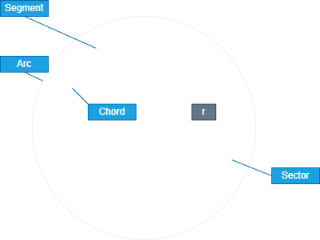

# Geometry
**Geometry**: a field of Mathematics consisting Entirely of Geometric Shapes and their Properties

- [Symmetry](#symmetry)
- [2D](#2D)
	- [Lines](#lines)
	- [Curves](#curves)
	- [Angles](#angles)
	- [Circle](#circle)
	- [Polygon](#polygon)
- [3D](#3D)
	- [Segments](#segments)
	- [Sphere](#sphere)
	- [Cube](#Cube)

Properties:
- **Vertex**: Meeting Point of 2 Line Segments
- **Adjacent sides**: lines that share a common vertex.
- **Adjacent angles**: angles that share a common side.

**Congruent**: when 2 shapes are equal and have the same size

## Symmetry

**Symmetry**: Figures with Evenly Balanced Proportions

## 2D

**Perimeter**: Length along the Boundaries of any Shape.

**Area**: Amount of area covered by any Shape.

### Lines

---

**Line Segment**: A Line that stop at 2 distinct points.

**Pairs**:
- **Point of Intersection**: when 2 lines cross each other and a point is formed

- **Parallel lines**: Lines that can Never Meet at any point.

- **Bisector**: a Line that divides another line or any Shape into 2 Pieces

- **Perpendicular**: when 2 Lines meet at 1 point and the Angle between them is $90\deg$ (`Right Angle`)

- **Perpendicular Bisector**: When a Line Bisects another line or Shape and the angle between them is a Right Angle

- **Transversal**: A lines that intersects two or more lines at distinct points

### Curves

---

**Simple Curve**: A Curve that doesn't cross itself

**Open Curve**: A Curve whose both points doesn't join each other

**Closed Curve**: A Curve whose both points joins each other

- **Interior**: Area Inside the Curve
- **Boundary**: Boundary of the Curve
- **Exterior**: Area Outside the Curve
- **Region**: Interior and Boundary

### Angles

---

Unit:

Angles measured in degrees 

- $A$ = angle

- $A\degree$ $A\deg$

- $360\degree$ is the maximum value.

Types:
- **Acute Angle**: in which angle is $<90\degree$
- **Right Angle**: in which angle is $90\degree$
- **Obtuse Angle**: in which angle is greater than $90\degree$ and less than $180\degree$.

	$\angle a > 90\degree \land  \angle a < 180\degree$

- **Straight Angle**: in which angle is $180\degree$
- **Reflex Angle**: in which angle is greater than $180\degree$ and less than $360\degree$.

	$\angle a > 180\degree \land  \angle a < 360\degree$

- **Complete Angle**: in which angle is $360\degree$

Sum Types:
- **Complementary Angles**: when sum of 2 angles equals to $90\degree$

	$\angle a + \angle b = 90\degree$

- **Supplementary Angles**: when sum of 2 angles equals to $180\degree$

	$\angle a + \angle b = 180\degree$

### Circle

---

Line Segments and Curves:

- **Radius**, $r$: length from the Center of the circle to it's boundary in a straight line.
	- *Raddi*: plural for 2Radius

- **Diameter**, $2r$: length from one side of the boundary of the circle to it's opposite side boundary in a straight line.

- **Circumference**: Length of the Entire Boundary (`Perimeter`) of the Circle

$$
2\pi r
$$

- **Chord**: a Line Connecting 2 Points on the Boundary of the Circle

Areas:

- **Complete Area**:
		
$$
\pi r^2
$$

- **Arc**: A specific area of the Boundary of the Circle

- **Sector**: Region in the interior of a circle enclosed by Arc and Raddi

- **Segment**: Region in the interior of a circle enclosed by a chord and the arc

Similar Shapes
- **Semi-circle**: Half of a Circle
- **Quadrant**: Quarter of a Circle

### Polygon

---
**Polygon**: A simple closed Shape made up only line segments

Properties:
- **Equiangular**: All interior angles equivalent to each-other.
- **Equilateral**: Length of all sides equivalent to each-other.
- **Diagonals**: lines that join any 2 opposite vertex of a Polygon.
- Sum of all exterior angles of any Polygon is `360\degree`deg.

Types:

- **Regular Polygon**: A Polygon which is Both Equiangular and Equilateral
- **Concave Polygon**: A Polygon with an In-words Curve
- **Convex Polygon**: A Polygon without any In-words Curve

#### **Triangle**: A Polygon with 3 sides

---

Properties: 
- $180\deg$ Sum of all Interior Angles
- Regular: $60\deg$
- Area: 
	$$\frac{1}{2}hb$$

**Types of triangles**
> The 3 Sides of the Triangle are declared as $a, b, c$ for representation purposes in this example
- **Side Length Based**:
	- **Scalene Triangle**: A Triangle with all of it's sides Unequal 
	$$a \neq b \neq c$$
	- **Isosceles Triangle**: A Triangle with 2 of it's sides equal and 1 not.
	$$a = b \neq c$$
	$$a \neq b = c$$
	$$a = c \neq b$$
	- **Equilateral Triangle**: A Triangle with all 3 of it's sides equal
	$$a = b = c$$
> The 3 Angles of the Triangle are declared as $a, b, c$ for representation purposes in this example
- **Angle Based**:
	- **Acute Angled Triangle**: A Triangle with All angles less than $90\deg$

	$$90 \deg > a \land  b \land  c$$
	- **Right Angled Triangle**: A Triangle with any one Angle equivalent to $90\deg$

	$$90 \deg = a \lor  b \lor  c$$
	- **Obtuse Angled Triangle**: A Triangle with any one Angle Greater than $90\deg$
	$$90 \deg > a \lor  b \lor  c$$

#### **Quadrilateral**: A Polygon with 4 Sides and Vertex

---

Properties: 
- $360\deg$ Sum of all Interior Angles
- Regular: $90\deg$

**Trapezium**: A Quadrilateral with a Set of parallel lines

- **Area**:
	$\frac{1}{2}hb$

**Kite**: a Quadrilateral with 2 distinct consecutive pairs of equal length

**Parallelogram**: a Quadrilateral with 2 Pairs of Parallel Lines

- **Area**: 
	$hb$

**Rhombus**: a Quadrilateral, Equilateral

- **Area**: 
	$\frac{1}{2}hw$

**Rectangle**: a Quadrilateral, Equiangular with sets of 2 pairs of parallel lines

- **Area**: 
	$hb$

**Square**: a Quadrilateral, Regular Polygon, Equilateral and Equiangular.

- **Area**: 
	$a^2$

#### **Pentagon**: A Polygon with 5 sides and vertex

---

- $540\deg$: sum of All Interior Angles
- Regular: $108\deg$

#### **Hexagon**: A Polygon with 6 sides and vertex

---

- $720\deg$: sum of All Interior Angles
- Regular: $120\deg$

## 3D

### Segments

---

**Surface Area**: Amount of Area exposed to the Outside of an object
- **Net**: Flattened version of Surface of a 3D shape into a 2D space
- **Cross-Section**: Area which gets exposed when cutting open a 3D Object

**Volume**: Amount of Space occupied by a 3D Object

**Face**: flat surface side of a 3d Shape

**Edge**: meeting of 2 Faces at a line segment

**Vertex**: Intersection point of 3 

### Sphere

---

**Sphere**: A 3 Dimentional Circle

### **Cube**

---

### **Triangular**

---

#### **Pyramid**

---

#### **Tetrahedron**

---
