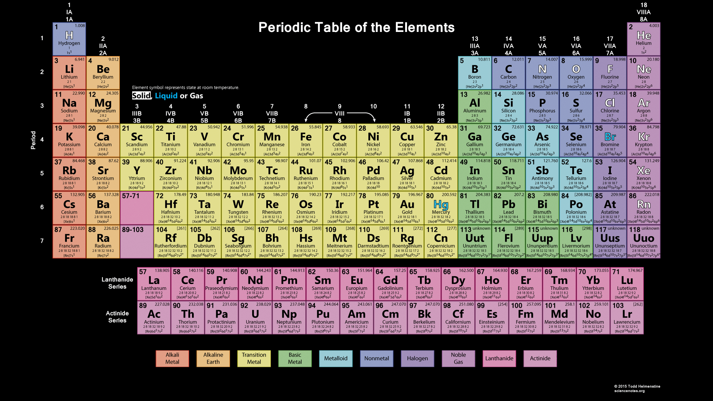

# Chemistry
## Acids and Bases
### Characterestics
**Acid**:

Nature: **Acidic**
- Sour

**Base**:

Nature: **Basic**
- Bitter
- Soapy

### Indicators

**Indicators**: special type of susbstances used to test whether if a substance is acidic or basic

Natural Indicators: turmeric*, *litmus*, *China rose petals*

**Litmus**:
- Extracted from **litchens**
- *Purple* Color
- Turns **Red** when in-contact with **Acidic** substance.
- Turns **Blue** when in-contact with **Basic** substance.
- No Color Change when substance is **Neutral**

**China Rose Petal**
- *Pink* Color
- Turns **Magenta** when in-contact with **Acidic** substance.
- Turns **Green** when in-contact with **Basic** substance.

### Neutralization

**Neutralization**: The process of: when an *Acidic* solution is mixed with a *Basic* solution and both Neutralize/Cancel the effects of each other.

Produces:
- **Water**
- **Heat**
- **Salt**

Example:-

**Hydrochloric Acid** + **Sodium Hydroxide** = **Sodium Chloride** + **DiHydrogen Monoxide**

**HCI** + **NaOH** = **NaCI** + **H2O**

 

**Phenolphthalein**: an Indicator for Neutralization

-  **Turns Colorless**: if Neutralized

**Magnesium Hydroxide**: Neutralises effect of Excessive amount of acids
**Formic Acid**: can be neutralized by **baking soda** or **calamine solution**

### Soild
- Too Acidic Soild can be Neutralized by **Quick Lime** `(Calcium Oxide)` or **slaked lime** `(Calcium Hydroxide)`
- Too Basic Soild can be Neutralized by **Compost**

### Acids and Bases Found in:
| Acids                     | Found              |
| ------------------------- | ------------------ |
| Acetic Acid               | Vinegar            |
| Formic Acid               | Ant's string       |
| Citric Acid               | Orange, lemons etc |
| Lactic Acid               | Curd               |
| Oxalic Acid               | Spinach            |
| Ascorbic Acid (Vitamin C) | Sour               |
| Tararic Acid              | Grapes, Mangoes    |

| Base                | Found            |
| ------------------- | ---------------- |
| Calcium Hydroxide   | Lime water       |
| Ammonium Hydroxide  | Window Cleaner   |
| Sodium Hydroxide    | Soap             |
| Potassium Hydroxide | Soap             |
| Magnesium Hydroxide | Milk of Magnesia |

## Periodic Table

### Elements:

**Non-Metal**:
| Chemical | Element      | Found                 | Useage               | Description |
| -------- | ------------ | --------------------- | -------------------- | ----------- |
| H        | Hydrogen     | Water                 |                      |
| C        | Carbon       | Atmosphere, Coal      |                      |
| N        | Nitrogen     | Atmosphere            |                      |
| O        | Oxygen       | Atmosphere, Water     |                      |
| P        | Phosphorus   | Phosphate Rock        | Matches, Fertilisers |
| Se       | Selenium     | Deep Underground      |                      |
**Alkalie Metal**:
| Li       | Lithium      | Brine deposits        | Batteries            |
| Na       | Sodium       | Salt                  | Soaps, Baking Soda   |
| K        | Potassium    |                       | Several Medicines    | Vital for Cells, similar to Sodium |
**Alkaline Earth**:
| Mg       | Magnesium    |                       |                      |
| Ca       | Calcium      |                       | A Mineral            |
| Ra       | Radium       |                       |                      |
**Transition Metal**:
| Ti       | Titanium     |                       |                      |
| Cr       | Chromium     |                       |                      |
| Mn       | Manganese    |                       |                      |
| Fe       | Iron         |                       | Structures, Machines | A very Hard and Touch Metal |
| Co       | Cobalt       |                       |                      |
| Ni       | Nickle       |                       |                      |
| Cu       | Copper       |                       | Wires                |
| Zn       | Zinc         |                       |                      |
| Ag       | Silver       |                       |                      |
| W        | Tungsten     |                       | Light Bulbs          | A Very Dense Metal       |
| Pt       | Platinum     | Rivers                |                      |
| Au       | Gold         | Rivers                |                      |
| Hg       | Mercury      |                       |                      | A Dangerous Liquid Metal |
**Transition Metal**:
| Al       | Aluminum     |                       | Containers           | 
| Ga       | Gallium      |                       |                      |
| In       | Indium       |                       |                      |
| Sn       | Tin          |                       | Cans                 |
**Metalloid**:
| B        | Boron        |                       |                      |
| Si       | Silicon      |                       | Electronics          |
| Ge       | Germanium    |                       |                      |
**Halogen**:
| F        | Flourine     |                       |                      |
| C        | Chlorine     |                       | Medicines, Solutions |
| Br       | Bromine      |                       |                      |
| I        | Iodine       |                       |                      |
**Noble Gas**:
| He       | Helium       |                       |                      |
| Ne       | Neon         |                       |                      |
| Ar       | Argon        |                       |                      |
| Xe       | Xenon        |                       |                      |
**Lanthanide Series**:
|          |              |                       |                      |
**Actinide Series**:
| Ac       | Actinium     |                       |                      |
| Th       | Thorium      |                       |                      |
| Pa       | Protactinium |                       |                      |
| U        | Uranium      | Deep in Earth's Crust | Nuclear Powerplants  |
| Np       | Neptunium    |                       |                      |
| Pu       | Plutonium    |                       |                      |

### Element Naming Rules

Prefixes:

| Prefix   | Atoms | Example                                        |
| -------- | ----- | ---------------------------------------------- |
| Mono-    | 1     | Carbon monoxide (CO)                           |
| Di-      | 2     | sulfur dioxide (SO2)                |
| Tri-     | 3     | Nitrogen trioxide (N2O3) |
| Tetra-   | 4     | Carbon tetrachloride (CCl4)         |
| Penta-   | 5     | Phosphorus pentachloride (PCl5)     |
| Hexa-    | 6     | Sulfur hexafluoride (SF6)           |
| Hepta-   | 7     | Iodine heptafluoride (IF7)          |
| Octa-    | 8     | Octasulfur (S8)                     |
| Nona-    | 9     | Iodine nonafluoride (IF9)           |
| Deca-    | 10    | Decaborane (B10H14)      |
| Undeca   | 11    | (Rare)                                         |
| Dodeca   | 12    | (Rare)                                         |

`Note: "Mono-" is often omitted for the first element if there is only one atom, but retained for the second (e.g., CO₂ is carbon dioxide, not monocarbon dioxide).`

`Note2: These prefixes are typically used in covalent (molecular) compounds, where two non-metals bond and share electrons.`

`Note3: For ionic compounds (metal-nonmetal combinations), prefixes are not used because the ratio of ions is determined by their charges.`

## Compounds:

| substance   | Element                     | chemical          |
| ----------- | --------------------------- | ----------------- |
| Water       | DiHydrogen Monoxide         | H2O    |
| Carbon Gas  | Carbon Dioxide              | CO2    |
| Baking Soda | Sodium Bicarbonate          | NaHCO3 |
| Edible Salt | Sodium Chloride             | NaCl              |
| Dynamite    | Nitroglycerine              | C3H5N3O9.     |
| TNT         | Trinitrotoulene             | C7H5N3O6.     |
| Ruby        | Aluminum Oxide              | Al2O3 `(Cr impurity)`               |
| Sapphire    | Aluminum Oxide              | Al2O3                               |
| Emerald     | Beryllium Aluminum Silicate | Be3Al2(SiO3)6 |

### 1 Word Compound References

| Refer         | Element                     | chemical          |
| ------------- | --------------------------- | ----------------- |
| Sulphate      | Sulfer Oxide                | SO                |
| Carbonate     | Carbon Trioxide             | CO3    |
| Bicarbonate   | Hydrogen Carbonate          | HCO3   |
| Nitrite       | Nitrogen Dioxide            | NO2    |
| Nitrate       | Nitrogen Trioxide           | NO3    |
| Peroxynitrate | Nitrogen Tetraoxide         | NO4    |

### Terms

**General Terms**:
| Term            | Description                 | Examples |
| --------------- | --------------------------- | -------- |
| `element` Oxide | unknown amount of oxygen    | CO2, SiO3 |

**Silicate**: Elements Related with [Silicon](#Chemistry)

## Changes

**Physical**: 
- **Physical Properties**:  
- 

**Chemical**: 
